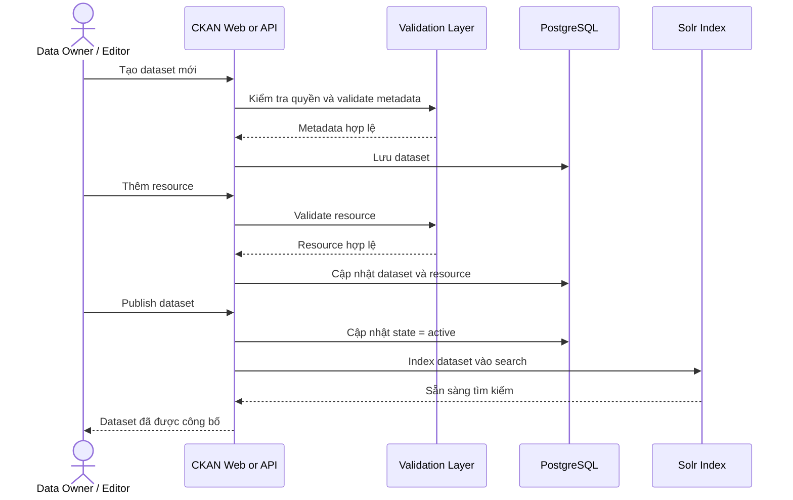
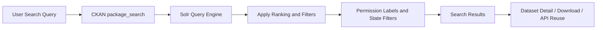
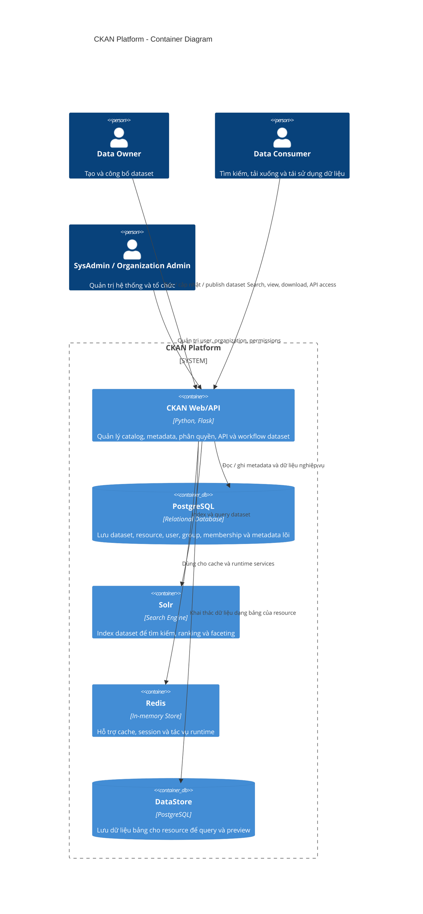
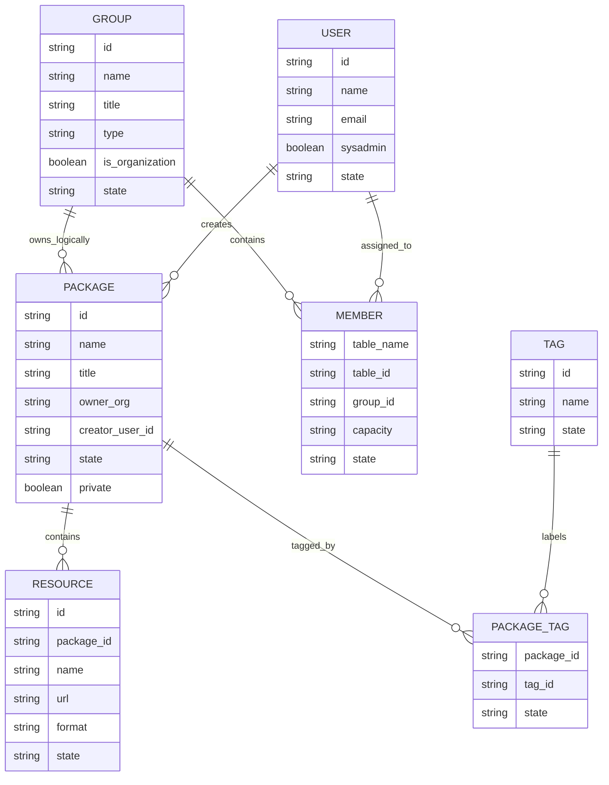

# CKAN Business Overview

## 1. Executive Summary

CKAN là một nền tảng quản lý và công bố dữ liệu dùng để xây dựng cổng dữ liệu tập trung cho tổ chức, doanh nghiệp hoặc cơ quan nhà nước. Về mặt nghiệp vụ, CKAN giải quyết bài toán chuẩn hóa việc thu thập, mô tả, công bố, tìm kiếm, truy cập và tái sử dụng dữ liệu thay vì để dữ liệu nằm rải rác trong email, thư mục dùng chung, hệ thống nội bộ hoặc từng nhóm chuyên môn riêng lẻ.

Trong hệ thống hiện tại của repo này, CKAN đóng vai trò là:

- Cổng catalog dữ liệu tập trung cho toàn tổ chức.
- Điểm quản trị metadata của dataset.
- Nền tảng kiểm soát quyền truy cập theo organization, vai trò người dùng và mức public/private.
- Điểm truy cập API và giao diện web cho tìm kiếm, xem và tái sử dụng dữ liệu.
- Hệ thống tích hợp với PostgreSQL, Solr, Redis và DataStore để phục vụ lưu trữ, tìm kiếm và khai thác dữ liệu dạng bảng.

### CKAN giải quyết bài toán gì?

- Thiếu một nơi duy nhất để biết tổ chức đang có những dataset nào.
- Metadata không đồng nhất, khó tìm, khó hiểu, khó tái sử dụng.
- Quyền truy cập dữ liệu phân tán, khó kiểm soát.
- Dataset được lưu nhưng không được index để tìm kiếm hiệu quả.
- Dữ liệu được công bố nhưng không đủ mô tả để người khác hiểu và dùng lại.

### Đối tượng sử dụng

- Product Owner cần nhìn toàn cảnh sản phẩm dữ liệu và giá trị mang lại.
- Business Analyst cần hiểu quy trình nghiệp vụ, vai trò và lifecycle của dataset.
- Data Governance Team cần chuẩn hóa metadata, quyền truy cập và data quality.
- Data Engineer cần hiểu luồng upload, resource, DataStore và API khai thác.
- Developer mới cần hiểu model, action API, search index và kiến trúc hệ thống.
- Người làm PowerPoint cần một cấu trúc nội dung rõ ràng, chia được thành slide.

### Giá trị mang lại

- Tăng khả năng tìm thấy dữ liệu.
- Chuẩn hóa cách mô tả và công bố dataset.
- Tách bạch rõ data owner, data steward, data consumer và quản trị hệ thống.
- Rút ngắn thời gian từ lúc tạo dataset đến lúc dataset được tìm thấy và tái sử dụng.
- Tạo nền tảng cho data governance, open data và self-service analytics.

### Trả lời câu hỏi: "Tại sao doanh nghiệp cần CKAN?"

Doanh nghiệp cần CKAN khi dữ liệu đã trở thành tài sản nhưng chưa được quản lý như một sản phẩm. CKAN biến dữ liệu từ trạng thái "có nhưng khó tìm, khó hiểu, khó dùng" thành "được quản trị, có metadata, có quyền truy cập, có API, có khả năng tìm kiếm và tái sử dụng". Nói ngắn gọn, CKAN không chỉ lưu dữ liệu, mà tổ chức hóa dữ liệu để tạo giá trị kinh doanh.

### Phạm vi và giả định

- Tài liệu này dựa trên CKAN core trong repo hiện tại, cùng các cấu hình và tài liệu đi kèm.
- Repo hiện tại phản ánh rõ kiến trúc lõi, action API, model dữ liệu, cơ chế search, quyền truy cập và cấu hình triển khai.
- Phần "Data Quality Scoring" không thấy có module chấm điểm mặc định trong CKAN core của repo này, nên phần đó được trình bày như một mô hình nghiệp vụ đề xuất dựa trên metadata hiện có.
- "Organization" trong CKAN core được lưu chung trong bảng `group`, được phân biệt bằng `type='organization'` hoặc cờ `is_organization`.

---

## 2. Các khái niệm nghiệp vụ chính

CKAN được hiểu tốt nhất khi xem nó như một "catalog dữ liệu". Trong catalog đó, mỗi khái niệm không chỉ là đối tượng kỹ thuật mà còn là một vai trò nghiệp vụ.

### Organization

**Mục đích**

Organization là đơn vị sở hữu dataset. Đây thường là phòng ban, đơn vị nghiệp vụ, cơ quan, trung tâm dữ liệu hoặc domain business.

**Vai trò**

- Xác định ai chịu trách nhiệm cho dataset.
- Là đơn vị phân quyền chính cho dataset private.
- Là lớp quản trị để gắn người dùng vào các vai trò Member, Editor, Admin.

**Ví dụ**

- Khối Tài chính
- Trung tâm Dữ liệu Khách hàng
- Sở Giao thông

### Group

**Mục đích**

Group dùng để gom các dataset theo chủ đề hoặc cộng đồng quan tâm, không nhất thiết phản ánh đơn vị sở hữu.

**Vai trò**

- Hỗ trợ phân loại nghiệp vụ theo domain hoặc chủ đề.
- Giúp người dùng duyệt dữ liệu theo taxonomy dễ hơn.
- Tăng khả năng khám phá dataset theo chủ đề.

**Ví dụ**

- Môi trường
- Giáo dục
- Giao thông công cộng

### Dataset

**Khái niệm**

Dataset là đối tượng nghiệp vụ trung tâm trong CKAN. Một dataset đại diện cho một tập dữ liệu được công bố trong catalog.

**Ý nghĩa**

- Là "sản phẩm dữ liệu" mà tổ chức muốn quản lý và công bố.
- Có metadata mô tả nội dung, phạm vi, chủ sở hữu, thẻ và trạng thái.
- Có thể gồm nhiều resource khác nhau.

**Vai trò trong hệ thống**

- Là đơn vị được tìm kiếm, hiển thị, phân quyền và quản trị lifecycle.
- Là đối tượng được index vào Solr để phục vụ search.
- Là trung tâm liên kết giữa metadata, resources, tags, groups và organization.

### Resource

**Là gì**

Resource là thành phần con của dataset, đại diện cho file, link, API endpoint, bảng dữ liệu hoặc nguồn truy cập cụ thể.

**Quan hệ với Dataset**

- Một dataset có thể có nhiều resource.
- Dataset mô tả "tập dữ liệu là gì".
- Resource mô tả "người dùng lấy dữ liệu ở đâu và bằng cách nào".

**Ví dụ**

- File CSV
- File Excel
- URL tải xuống
- API endpoint JSON

### Tag

**Là gì**

Tag là nhãn nghiệp vụ dùng để mô tả nhanh chủ đề hoặc từ khóa liên quan đến dataset.

**Mục đích**

- Tăng khả năng tìm kiếm.
- Hỗ trợ phân loại không chính thức, linh hoạt hơn group.
- Cải thiện khả năng khám phá dữ liệu theo ngữ nghĩa business.

### User

**Vai trò**

User là người tương tác với hệ thống với tư cách quản trị, biên tập, công bố hoặc tiêu thụ dữ liệu.

**Quyền hạn**

Tùy vai trò, user có thể:

- Chỉ xem dataset public.
- Xem dataset private trong organization của mình.
- Tạo, sửa, publish dataset.
- Quản lý thành viên organization.
- Quản trị toàn hệ thống nếu là sysadmin.

### Data Quality

**Ý nghĩa**

Data Quality trong bối cảnh CKAN chủ yếu phản ánh mức độ đầy đủ, rõ ràng và khả năng tái sử dụng của metadata và resource.

**Vai trò**

- Giúp ưu tiên dataset nào sẵn sàng công bố rộng rãi.
- Giúp Data Governance Team xác định dataset cần bổ sung metadata.
- Tạo cơ sở để xếp hạng, gắn badge hoặc quản trị chất lượng danh mục dữ liệu.

### Bảng tóm tắt khái niệm

| Khái niệm | Ý nghĩa | Ví dụ |
| --------- | ------- | ----- |
| Organization | Đơn vị sở hữu và quản trị dataset | Khối Tài chính |
| Group | Nhóm phân loại dataset theo chủ đề | Môi trường |
| Dataset | Sản phẩm dữ liệu trung tâm trong catalog | Bộ dữ liệu giao dịch tháng |
| Resource | Nguồn truy cập cụ thể của dataset | File CSV, API, Excel |
| Tag | Từ khóa mô tả nhanh dataset | finance, traffic, climate |
| User | Người sử dụng hoặc quản trị hệ thống | SysAdmin, Editor |
| Data Quality | Mức độ đầy đủ và sẵn sàng sử dụng của dataset | Dataset có title, notes, tag, resource |

---

## 3. Sơ đồ nghiệp vụ tổng thể

Luồng nghiệp vụ tổng quát của CKAN là: một Data Owner hoặc Data Steward đưa dataset vào catalog, hệ thống kiểm tra metadata, công bố dataset, index để tìm kiếm, sau đó Data Consumer có thể tìm, tải và tái sử dụng.

```mermaid
flowchart LR
    A[Data Owner] --> B[Create or Upload Dataset]
    B --> C[Enter Metadata]
    C --> D[Metadata Validation]
    D --> E[Add Resources]
    E --> F[Publish Dataset]
    F --> G[Dataset Catalog]
    G --> H[Solr Search Index]
    H --> I[Search and Discovery]
    I --> J[Download or API Access]
    J --> K[Reuse in Analytics, BI, Apps]
```



### Ý nghĩa nghiệp vụ của sơ đồ

- Data Owner chịu trách nhiệm đưa dữ liệu vào hệ thống.
- Metadata Validation là điểm kiểm soát chất lượng tối thiểu trước khi công bố.
- Dataset Catalog là nơi chuẩn hóa việc công bố tài sản dữ liệu.
- Search là năng lực quan trọng nhất để biến catalog thành công cụ sử dụng thực tế.
- Download, API Access và Reuse là nơi giá trị kinh doanh được tạo ra.

---

## 4. Vai trò người dùng

Trong CKAN hiện tại, quyền được kiểm soát theo 3 lớp:

- Quyền toàn hệ thống của `SysAdmin`.
- Quyền trong phạm vi organization: `Admin`, `Editor`, `Member`.
- Quyền xem công khai cho `Anonymous User`.

Lưu ý thêm:

- Dataset collaborators là tính năng tùy chọn trong CKAN, không bật mặc định trong cấu hình lõi.
- Trong tài liệu này, "Organization Admin" tương ứng vai trò `Admin` trong organization.

### SysAdmin

**Quyền gì?**

- Toàn quyền trên hệ thống.
- Xem, sửa và quản trị mọi organization, dataset và user.
- Có thể thao tác với dữ liệu private mà không cần là thành viên organization.
- Quản trị cấu hình, người dùng và vận hành hệ thống.

### Organization Admin

**Quyền gì?**

- Quản trị organization của mình.
- Thêm, xóa, thay đổi vai trò thành viên.
- Tạo, sửa, publish dataset trong organization.
- Xem dataset private của organization.

### Editor

**Quyền gì?**

- Tạo dataset trong organization.
- Sửa metadata và resources.
- Publish dataset.
- Xem dataset private của organization.
- Không quản lý thành viên organization.

### Member

**Quyền gì?**

- Xem dataset private của organization.
- Tìm kiếm và xem dữ liệu thuộc phạm vi organization.
- Không tạo hoặc publish dataset nếu không được cấp thêm quyền khác.

### Anonymous User

**Quyền gì?**

- Xem dataset public.
- Tìm kiếm dataset public.
- Tải resource public.
- Không xem dataset private.
- Không tạo dataset nếu không cấu hình đặc biệt cho phép anonymous create.

### Bảng phân quyền

| Vai trò | Xem dataset public | Xem dataset private | Tạo dataset | Sửa dataset | Publish dataset | Quản lý thành viên | Quản trị toàn hệ thống |
| ------- | ------------------ | ------------------- | ----------- | ----------- | --------------- | ------------------ | ---------------------- |
| SysAdmin | Có | Có, toàn hệ thống | Có | Có | Có | Có | Có |
| Organization Admin | Có | Có, trong organization của mình | Có | Có | Có | Có | Không |
| Editor | Có | Có, trong organization của mình | Có | Có | Có | Không | Không |
| Member | Có | Có, trong organization của mình | Không mặc định | Không mặc định | Không | Không | Không |
| Anonymous User | Có | Không | Không mặc định | Không | Không | Không | Không |

### Nhận xét nghiệp vụ

- Organization là đơn vị chịu trách nhiệm chính cho dataset.
- Admin và Editor là hai vai trò vận hành nội dung dữ liệu quan trọng nhất.
- Member phù hợp cho vai trò tiêu thụ nội bộ dữ liệu.
- Anonymous User phục vụ open data hoặc chia sẻ công khai.

---

## 5. Luồng tạo Dataset

Luồng tạo dataset trong CKAN hiện tại có thể diễn giải theo nghiệp vụ như sau.

### Bước 1: Người dùng tạo Dataset

Người dùng có quyền phù hợp bắt đầu tạo một dataset mới. Trong CKAN core, thao tác này đi qua action `package_create`.

**Ý nghĩa nghiệp vụ**

- Khởi tạo một thực thể dữ liệu mới trong catalog.
- Gắn dataset vào một đơn vị sở hữu nếu có `owner_org`.
- Bắt đầu vòng đời quản trị metadata.

### Bước 2: Nhập Metadata

Người dùng nhập các thông tin mô tả như title, notes, tags, organization, groups, extras.

**Ý nghĩa nghiệp vụ**

- Biến dữ liệu thô thành một asset có thể hiểu được.
- Cung cấp ngữ cảnh cho search, governance và tái sử dụng.

### Bước 3: Thêm Resource

Người dùng thêm file, URL hoặc nguồn truy cập dữ liệu cho dataset.

**Ý nghĩa nghiệp vụ**

- Liên kết metadata với dữ liệu thực tế.
- Cho phép dataset được tải xuống hoặc truy cập qua API.

### Bước 4: Publish

Dataset được chuyển sang trạng thái sẵn sàng công bố, thường là `active`. Đồng thời cần xét thêm yếu tố public/private.

**Ý nghĩa nghiệp vụ**

- Dataset chuyển từ trạng thái soạn thảo sang trạng thái có thể được phát hiện và sử dụng.
- Publish không chỉ là lưu dữ liệu, mà là đưa dữ liệu vào vòng đời công bố chính thức.

### Bước 5: Dataset được Index Search

Sau khi tạo hoặc cập nhật, dataset được đưa vào search index để người dùng tìm kiếm.

**Ý nghĩa nghiệp vụ**

- Nếu dataset chưa được index, về mặt business gần như dataset "chưa tồn tại" đối với người tiêu dùng dữ liệu.
- Search index là cầu nối giữa dữ liệu đã công bố và khả năng được sử dụng thực tế.

### Sequence Diagram



### Góc nhìn vận hành

- Validation nằm trước lưu trữ.
- Resource là phần con của dataset nhưng có vai trò quyết định khả năng sử dụng thực tế.
- Publish và index là hai bước business rất quan trọng, không nên xem như chi tiết hạ tầng.

---

## 6. Metadata của Dataset

CKAN core trong repo hiện tại thể hiện dataset bằng model `package`. Ở góc nhìn nghiệp vụ, dataset có một tập metadata lõi giúp mô tả, phân loại, phân quyền và công bố dataset.

Lưu ý:

- Trong database, người tạo được lưu bằng trường `creator_user_id`.
- Trong tài liệu này, để dễ đọc theo góc nhìn nghiệp vụ, trường này được diễn đạt là `creator`.

### Bảng metadata chính

| Trường | Ý nghĩa nghiệp vụ | Bắt buộc theo business | Ghi chú |
| ------ | ----------------- | ---------------------- | ------- |
| `title` | Tên hiển thị của dataset | Nên có | Là trường người dùng nhìn thấy đầu tiên |
| `notes` | Mô tả nội dung, phạm vi và ngữ cảnh | Nên có | Cực kỳ quan trọng cho hiểu và tái sử dụng |
| `tags` | Từ khóa mô tả chủ đề | Nên có | Tăng khả năng search và discovery |
| `owner_org` | Organization sở hữu dataset | Nên có trong môi trường enterprise | Phục vụ phân quyền và accountability |
| `resources` | Danh sách nguồn dữ liệu cụ thể | Nên có | Dataset không có resource thường khó sử dụng |
| `extras` | Metadata mở rộng | Nên có nếu có governance requirement | Dùng cho các trường business tùy biến |
| `groups` | Nhóm phân loại theo chủ đề | Tùy chọn | Hỗ trợ duyệt catalog theo taxonomy |
| `state` | Trạng thái lifecycle | Bắt buộc về mặt hệ thống | Ví dụ `draft`, `active`, `deleted` |
| `creator` | Người tạo dataset | Nên lưu đầy đủ | Trong model lõi là `creator_user_id` |

### Giải thích từng trường

#### `title`

- Là tên business của dataset.
- Cần rõ ràng, dễ hiểu, không quá kỹ thuật.
- Ảnh hưởng trực tiếp đến khả năng tìm kiếm và mức độ tin cậy của catalog.

#### `notes`

- Là mô tả chi tiết dataset.
- Nên trả lời được: dữ liệu nói về gì, phạm vi thời gian nào, đơn vị đo là gì, ai sử dụng được.
- Nếu `notes` quá ngắn, người dùng sẽ khó quyết định có nên dùng dataset hay không.

#### `tags`

- Hỗ trợ người dùng tìm dataset bằng từ khóa gần nghĩa với nghiệp vụ.
- Là lớp phân loại mềm, linh hoạt hơn group.

#### `owner_org`

- Xác định đơn vị chịu trách nhiệm cho dataset.
- Là trường nghiệp vụ quan trọng nhất để gắn ownership.
- Có liên quan trực tiếp đến quyền xem private và quyền chỉnh sửa.

#### `resources`

- Là đầu ra hữu hình của dataset.
- Có thể là file tải xuống, link, API hoặc dữ liệu dạng bảng.
- Một dataset có metadata tốt nhưng không có resource thì giá trị sử dụng bị hạn chế.

#### `extras`

- Là nơi mở rộng metadata cho các nhu cầu quản trị riêng.
- Có thể dùng cho domain, độ nhạy dữ liệu, tần suất cập nhật, SLA, data steward, mức chất lượng.

#### `groups`

- Dùng để đưa dataset vào các nhóm chủ đề.
- Có giá trị cao với người dùng duyệt catalog hơn là người dùng search trực tiếp.

#### `state`

- Thể hiện lifecycle kỹ thuật và nghiệp vụ của dataset.
- `draft` phù hợp với giai đoạn soạn thảo.
- `active` phù hợp với giai đoạn công bố.
- `deleted` phản ánh dataset không còn được dùng.

#### `creator`

- Xác định người khởi tạo dataset.
- Hữu ích cho audit, truy vết và quản trị trách nhiệm.

### Kết luận nghiệp vụ về metadata

Metadata là lớp tạo giá trị cho dataset. Nếu resource là "dữ liệu có thật", thì metadata là "ngữ cảnh để dữ liệu có thể được hiểu, tìm thấy và tái sử dụng". CKAN mạnh ở chỗ nó chuẩn hóa lớp metadata này.

---

## 7. Luồng Search Dataset

Trong CKAN, search không chỉ là một tính năng hỗ trợ, mà là cửa ngõ chính để người dùng khám phá dữ liệu. Về nghiệp vụ, hành trình tìm kiếm diễn ra như sau:

1. Người dùng nhập từ khóa hoặc bộ lọc.
2. CKAN gửi truy vấn đến action `package_search`.
3. Hệ thống dùng Solr để tìm và xếp hạng dataset.
4. Kết quả được lọc thêm theo quyền truy cập và trạng thái dữ liệu.
5. Người dùng nhận danh sách dataset phù hợp để xem chi tiết hoặc tải về.

### Ý nghĩa của Solr trong nghiệp vụ

- Solr giúp tìm kiếm theo từ khóa, faceting và ranking.
- Dataset không chỉ được tìm theo tên, mà còn theo notes, tag, groups, organization và metadata đã được index.
- Thứ tự mặc định ưu tiên `score desc, metadata_modified desc`, nghĩa là vừa theo mức độ phù hợp vừa theo độ mới của metadata.

### Search Diagram



### Các yếu tố ảnh hưởng kết quả search

- Từ khóa người dùng nhập.
- Metadata đã được index hay chưa.
- Trạng thái dataset như `active`, `draft`, `deleted`.
- Mức public/private.
- Permission labels theo user và organization.
- Metadata quality của title, notes, tags, groups, organization và resources.

### Góc nhìn business

- Search tốt biến catalog thành công cụ làm việc thực tế.
- Search kém khiến người dùng nghĩ rằng tổ chức "không có dữ liệu", dù dữ liệu vẫn đang tồn tại.
- Search index và governance metadata phải đi cùng nhau.

---

## 8. Kiến trúc hệ thống

Từ cấu hình và tài liệu trong repo hiện tại, kiến trúc CKAN bao gồm các thành phần chính sau:

- **CKAN**: ứng dụng web và API trung tâm, chạy business logic, quản trị metadata, quyền và workflow.
- **PostgreSQL**: lưu dữ liệu nghiệp vụ lõi như dataset, resource, user, group, membership.
- **Solr**: công cụ search index cho dataset.
- **Redis**: hỗ trợ cache, session và một số background capability.
- **DataStore**: PostgreSQL dành cho dữ liệu dạng bảng của resource để query và preview.

### Diễn giải vai trò từng thành phần

#### CKAN

- Giao diện web cho người dùng cuối.
- API action cho tích hợp hệ thống.
- Thực thi validation, auth, lifecycle và indexing.

#### PostgreSQL

- Là hệ thống bản ghi chính của catalog.
- Lưu object nghiệp vụ lõi của CKAN.

#### Solr

- Lưu search document phục vụ tìm kiếm nhanh.
- Không thay thế database giao dịch, mà bổ trợ cho discovery.

#### Redis

- Hỗ trợ các nhu cầu runtime như cache và xử lý phụ trợ.
- Giúp giảm tải cho các thao tác lặp lại.

#### DataStore

- Phục vụ dữ liệu dạng bảng ở mức record-level query.
- Phù hợp cho preview và Data API.
- Tách biệt với metadata catalog, nhưng liên kết chặt với resource.

### Hiện trạng cấu hình trong repo này

- Stack test/dev hiện tại dùng `ckan`, `ckan-postgres`, `ckan-solr`, `ckan-redis`.
- Cấu hình `test-core.ini` và `test-core-ci.ini` thể hiện rõ kết nối tới PostgreSQL, Solr, Redis và DataStore.
- DataStore dùng một database riêng về mặt logic, dù có thể cùng server PostgreSQL.
- `test-core-local.ini` đang override `site_url` cho môi trường local.

### C4 Container Diagram



### Kết luận kiến trúc

CKAN là kiến trúc catalog tách rõ:

- Metadata catalog trong PostgreSQL.
- Search index trong Solr.
- Runtime support trong Redis.
- Dữ liệu bảng có thể query trong DataStore.

Sự tách lớp này giúp hệ thống vừa phù hợp cho quản trị catalog, vừa phù hợp cho khai thác dữ liệu thực tế.

---

## 9. API chính

CKAN sử dụng Action API, thường có dạng:

```text
/api/3/action/<action_name>
```

Các API dưới đây là nhóm quan trọng nhất cho vận hành catalog dữ liệu.

### 9.1 `package_search`

**Mục đích**

- Tìm kiếm dataset theo từ khóa, filter, facet và sort.

**Input**

- `q`: từ khóa tìm kiếm
- `fq` hoặc `fq_list`: điều kiện lọc
- `rows`, `start`: phân trang
- `sort`: sắp xếp
- `facet.field`: trường facet

**Output**

- `count`: tổng số kết quả
- `results`: danh sách dataset
- `search_facets`: thông tin facet

**Ví dụ**

```json
POST /api/3/action/package_search
{
  "q": "traffic",
  "rows": 10,
  "sort": "score desc, metadata_modified desc"
}
```

### 9.2 `package_show`

**Mục đích**

- Xem chi tiết một dataset.

**Input**

- `id` hoặc `name_or_id`

**Output**

- Metadata chi tiết của dataset
- `resources`
- `groups`
- `organization`

**Ví dụ**

```json
POST /api/3/action/package_show
{
  "id": "traffic-open-data"
}
```

### 9.3 `package_create`

**Mục đích**

- Tạo dataset mới trong catalog.

**Input**

- `name`
- `title`
- `notes`
- `owner_org`
- `tags`
- `resources`
- `extras`

**Output**

- Dataset vừa tạo
- Hoặc chỉ trả `id` trong một số context kỹ thuật

**Ví dụ**

```json
POST /api/3/action/package_create
{
  "name": "traffic-open-data",
  "title": "Traffic Open Data",
  "notes": "Bo du lieu giao thong cong cong theo ngay",
  "owner_org": "transport-department",
  "tags": [{"name": "traffic"}],
  "resources": [
    {
      "name": "Daily CSV",
      "url": "https://example.org/traffic.csv",
      "format": "CSV"
    }
  ]
}
```

### 9.4 `organization_list`

**Mục đích**

- Lấy danh sách organization trong hệ thống.

**Input**

- `all_fields`
- `include_extras`
- `include_users`
- `sort`
- `limit`

**Output**

- Danh sách tên organization hoặc object organization tùy tham số

**Ví dụ**

```json
POST /api/3/action/organization_list
{
  "all_fields": true,
  "include_users": false
}
```

### 9.5 `group_list`

**Mục đích**

- Lấy danh sách group phân loại chủ đề.

**Input**

- `all_fields`
- `include_dataset_count`
- `include_extras`
- `sort`

**Output**

- Danh sách group hoặc object group

**Ví dụ**

```json
POST /api/3/action/group_list
{
  "all_fields": true
}
```

### 9.6 `resource_create`

**Mục đích**

- Thêm resource mới vào một dataset hiện có.

**Input**

- `package_id`
- `url`
- `name`
- `description`
- `format`

**Output**

- Resource vừa tạo

**Ví dụ**

```json
POST /api/3/action/resource_create
{
  "package_id": "traffic-open-data",
  "name": "API Feed",
  "url": "https://example.org/api/traffic",
  "format": "JSON"
}
```

### Bảng tóm tắt API

| API | Mục đích nghiệp vụ | Input chính | Output chính |
| --- | ------------------ | ----------- | ------------ |
| `package_search` | Tìm dataset | `q`, `fq`, `sort`, `rows` | Danh sách dataset + facets |
| `package_show` | Xem chi tiết dataset | `id` | Dataset đầy đủ metadata |
| `package_create` | Tạo dataset mới | `name`, `title`, `owner_org`, `resources` | Dataset mới tạo |
| `organization_list` | Xem danh sách đơn vị sở hữu | `all_fields` | Danh sách organization |
| `group_list` | Xem danh sách nhóm chủ đề | `all_fields` | Danh sách group |
| `resource_create` | Thêm nguồn dữ liệu vào dataset | `package_id`, `url`, `format` | Resource mới tạo |

### Ý nghĩa nghiệp vụ của Action API

- API không chỉ phục vụ tích hợp kỹ thuật.
- Đây là cách chuẩn để hệ thống khác tham gia vòng đời quản trị dữ liệu.
- Có thể dùng cho ingestion, synchronization, data catalog automation và quality control.

---

## 10. Database Mapping

CKAN core tổ chức dữ liệu theo các bảng lõi dưới đây.

### Mapping chính

| Đối tượng nghiệp vụ | Bảng / thực thể chính | Ý nghĩa |
| ------------------- | --------------------- | ------- |
| Dataset | `package` | Lưu metadata lõi của dataset |
| Resource | `resource` | Lưu nguồn truy cập cụ thể của dataset |
| User | `user` | Lưu tài khoản người dùng |
| Group | `group` | Lưu group phân loại chủ đề |
| Organization | `group` | Dùng chung bảng `group`, phân biệt bằng `type='organization'` |
| Membership | `member` | Liên kết user, group, organization, package theo vai trò |
| Tag | `tag` và `package_tag` | Gắn tag cho dataset |

### Quan hệ nghiệp vụ

- Một organization có nhiều dataset.
- Một dataset có nhiều resource.
- Một dataset có nhiều tag.
- Một dataset có thể thuộc nhiều group.
- Một organization có nhiều user theo các vai trò khác nhau.
- Một user có thể thuộc nhiều organization.

### Lưu ý quan trọng

- `owner_org` trong `package` thể hiện quan hệ logic tới organization.
- Ở CKAN core hiện tại, organization không phải bảng riêng mà là biến thể của `group`.
- Bảng `member` là bảng rất quan trọng vì chứa logic membership và role.

### ERD Mermaid



### Diễn giải business của ERD

- `PACKAGE` là hạt nhân của catalog.
- `RESOURCE` là hiện thân thực tế của dữ liệu.
- `GROUP` vừa đóng vai trò chủ đề, vừa đóng vai trò organization khi được đánh dấu tương ứng.
- `MEMBER` là cầu nối giữa con người, vai trò và quyền trong hệ thống.

---

## 11. Các điểm cần lưu ý khi phát triển

### Validation

- Không nên chỉ kiểm tra form ở UI; validation nghiệp vụ cần đảm bảo ở API/action layer.
- Metadata quan trọng như `title`, `notes`, `owner_org`, `resources` nên có rule rõ ràng.

### Search Index

- Sau khi tạo hoặc sửa dataset, cần đảm bảo dataset được reindex.
- Nếu search index không đồng bộ, người dùng có thể không tìm thấy dataset hoặc thấy sai quyền truy cập.

### Permission

- Phân quyền của CKAN phụ thuộc mạnh vào organization, role và permission labels trên search index.
- Khi thay đổi cơ chế quyền, đặc biệt với private dataset và collaborators, cần reindex lại dataset.

### Metadata Quality

- Chất lượng catalog phụ thuộc nhiều hơn vào metadata đầy đủ hơn là số lượng dataset.
- Nên chuẩn hóa business glossary cho `title`, `notes`, `tags`, `extras`.

### Dataset Lifecycle

- Cần định nghĩa rõ vòng đời nghiệp vụ: draft, review, active, archived hoặc deleted.
- Publish nên được xem là một cột mốc nghiệp vụ, không chỉ là thao tác kỹ thuật.

### Organization Ownership

- `owner_org` nên là trường gần như bắt buộc trong môi trường enterprise.
- Không có ownership rõ ràng sẽ gây khó khăn cho governance và vận hành.

### Resource Strategy

- Một dataset có giá trị sử dụng thấp nếu không có resource truy cập rõ ràng.
- Nên quy ước rõ resource nào là file, resource nào là API, resource nào là DataStore table.

### Extras Governance

- `extras` rất mạnh nhưng dễ bị lạm dụng nếu không có chuẩn.
- Nên thống nhất danh sách custom fields và định nghĩa nghiệp vụ cho từng field.

---

## 12. Slide Outline

Mục tiêu của outline dưới đây là để một AI khác có thể chuyển trực tiếp thành PowerPoint mà không cần phân tích lại toàn bộ repo.

| Slide | Tiêu đề | Nội dung chính | Hình minh họa đề xuất | Diagram đề xuất |
| ----- | ------- | -------------- | --------------------- | --------------- |
| 1 | Giới thiệu CKAN | CKAN là gì, tại sao tổ chức dùng CKAN, vai trò của một data catalog | Hình cổng dữ liệu doanh nghiệp | Không cần hoặc icon overview |
| 2 | Bài toán kinh doanh | Dữ liệu phân tán, khó tìm, thiếu ownership, thiếu metadata | Hình dữ liệu nằm rải rác ở nhiều hệ thống | Flow đơn giản "data silos -> catalog" |
| 3 | Giá trị mang lại | Search tốt hơn, governance tốt hơn, tái sử dụng tốt hơn | Hình người dùng tìm thấy dữ liệu nhanh | Value chain diagram |
| 4 | Khái niệm chính | Organization, Group, Dataset, Resource, Tag, User, Data Quality | Bộ icon cho từng khái niệm | Concept map |
| 5 | Vai trò người dùng | SysAdmin, Organization Admin, Editor, Member, Anonymous | Ma trận vai trò và quyền | Permission matrix |
| 6 | Luồng nghiệp vụ tổng thể | Từ upload đến search, download và reuse | Minh họa hành trình dataset | Flowchart tổng thể |
| 7 | Luồng tạo Dataset | Tạo dataset, nhập metadata, thêm resource, publish, index | Form metadata và upload file | Sequence diagram |
| 8 | Metadata quan trọng | `title`, `notes`, `tags`, `owner_org`, `resources`, `extras`, `state`, `creator` | Form metadata mẫu | Metadata table / data card |
| 9 | Data Quality Scoring | Tại sao cần chấm điểm, tiêu chí, ví dụ tính điểm | Gauge hoặc score card | Score formula / heatmap |
| 10 | Luồng Search | Query -> Solr -> ranking -> permission -> kết quả | Thanh search và kết quả | Search flowchart |
| 11 | Kiến trúc hệ thống | CKAN, PostgreSQL, Solr, Redis, DataStore | Sơ đồ container | C4 Container Diagram |
| 12 | API chính | package_search, package_show, package_create, organization_list, group_list, resource_create | API cards | API interaction diagram |
| 13 | Database Mapping | package, resource, user, group, organization, member, tag | Hình entity card | ERD Mermaid |
| 14 | Điểm cần lưu ý khi phát triển | Validation, reindex, permission, metadata quality, lifecycle | Checklist kiến trúc | Risk and control diagram |
| 15 | Kết luận và khuyến nghị | CKAN là nền tảng catalog dữ liệu, cần governance đi kèm, đề xuất triển khai tiếp theo | Lộ trình roadmap | Roadmap diagram |

### Gợi ý cách trình bày PowerPoint

- Ưu tiên 1 thông điệp chính cho mỗi slide.
- Với slide nghiệp vụ, dùng ngôn ngữ business trước, thuật ngữ kỹ thuật sau.
- Với slide kỹ thuật, luôn neo lại bằng câu hỏi "nó hỗ trợ nghiệp vụ gì?".
- Với mọi bảng lớn, nên rút gọn thành 3 đến 5 ý chính khi lên slide.
- Các Mermaid trong tài liệu này có thể được chuyển sang sơ đồ đẹp hơn khi dựng slide.

---

## Kết luận cuối

CKAN trong repo hiện tại thể hiện đúng bản chất của một nền tảng data catalog doanh nghiệp:

- Có mô hình dữ liệu rõ cho dataset, resource, user, group và organization.
- Có lớp action API rõ ràng cho tạo, xem, tìm kiếm và quản trị catalog.
- Có cơ chế search riêng bằng Solr để biến metadata thành năng lực discovery thực sự.
- Có quyền truy cập theo organization và lifecycle dataset phù hợp với quản trị dữ liệu.
- Có thể mở rộng để phục vụ data quality, governance dashboard, automation và self-service data platform.

Nếu triển khai đúng cách, CKAN không chỉ là nơi "đăng file dữ liệu", mà là một lớp sản phẩm dữ liệu giúp doanh nghiệp quản trị dữ liệu như một tài sản dùng được, tìm được và tái sử dụng được.
