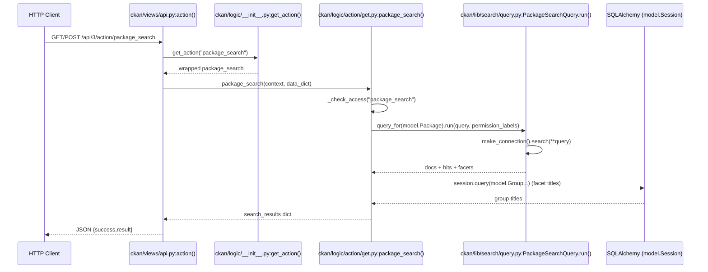
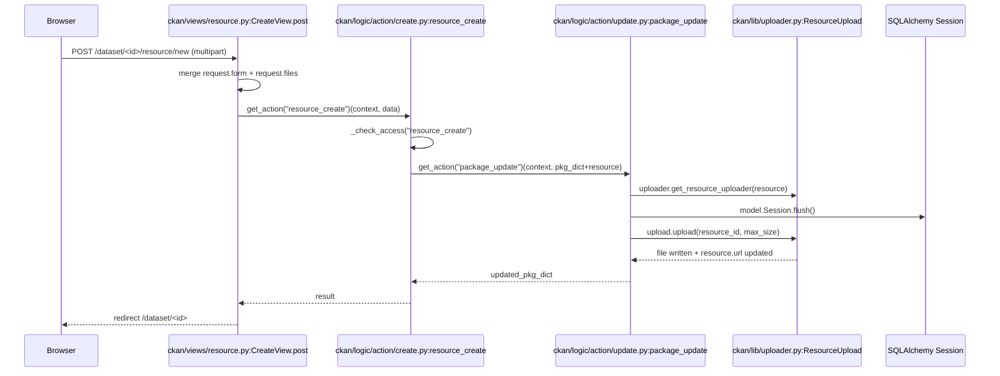
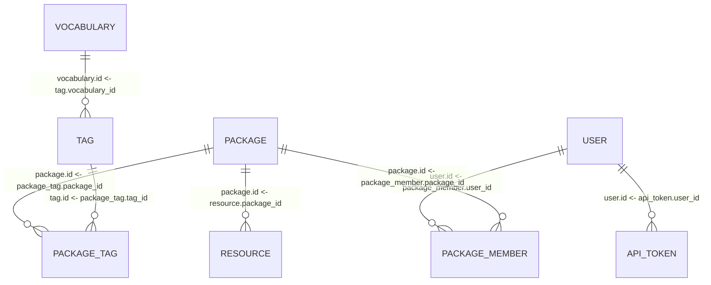
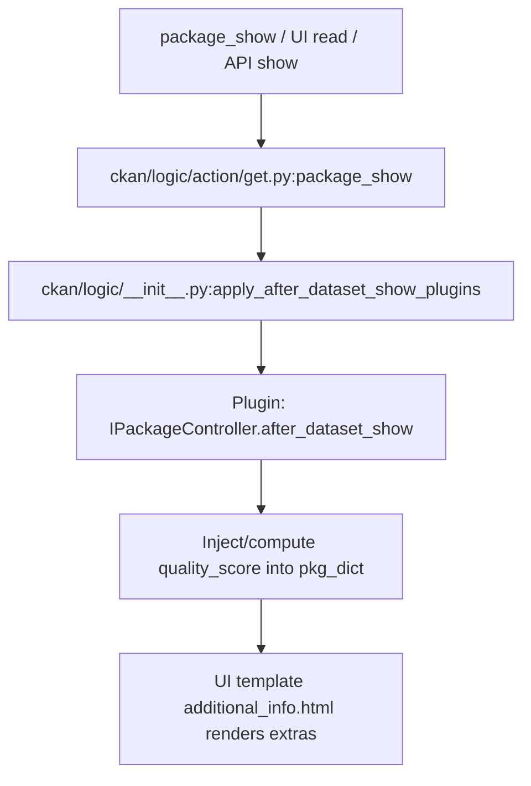
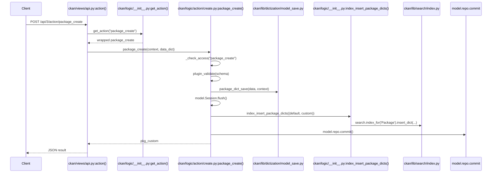
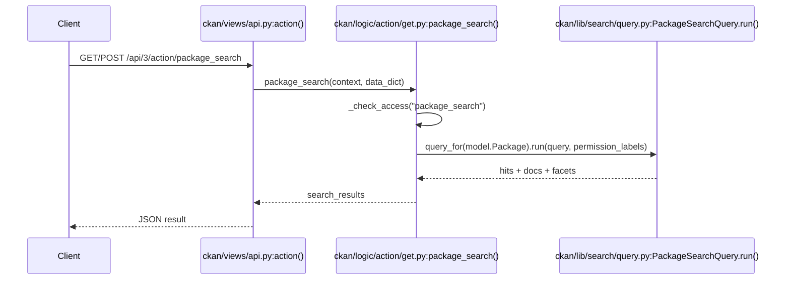
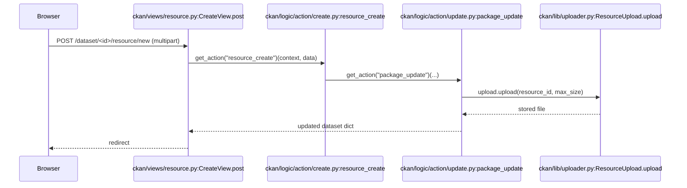
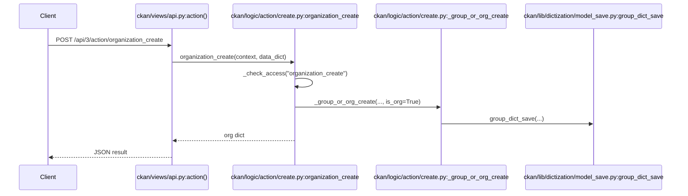
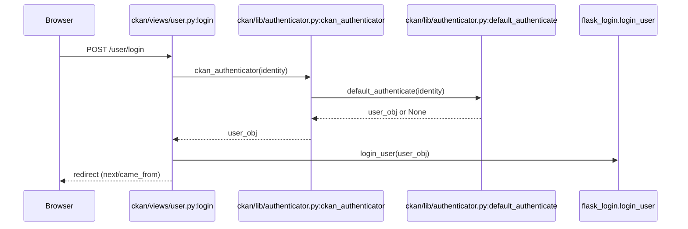

# CKAN Runtime Code Flow Analysis (theo source hiện tại)

Tài liệu này mô tả luồng chạy runtime của CKAN theo đúng source code trong repo hiện tại, tập trung vào:

- Entry point / WSGI app factory / middleware / routing
- Luồng request Web UI và Action API
- Luồng logic/service, DB (SQLAlchemy), Search (Solr), Plugin hooks
- Mapping file → class/function → line number (đủ để debug)

---

## 1. Kiến trúc source code (tổng quan theo thư mục)

### 1.1 Cây thư mục rút gọn (trích từ `ckan/`)

```text
ckan/
├── cli/
├── config/
│   ├── middleware/
│   └── solr/
├── lib/
│   ├── dictization/
│   ├── files/
│   └── search/
├── logic/
│   ├── action/
│   ├── auth/
│   └── schema/
├── migration/
├── model/
├── plugins/
├── public/
├── templates/
├── views/
├── authz.py
└── common.py
```

### 1.2 Vai trò / trách nhiệm từng thư mục (góc nhìn runtime)

#### `ckan/config/`

- **Vai trò**: Bootstrap môi trường runtime (config, plugin load, DB engine, search schema check, template/public paths), và dựng WSGI/Flask stack.
- **Khi nào được gọi**:
  - `make_app()` là app factory được gọi bởi WSGI entrypoint (`wsgi.py`) khi server start.
  - `load_environment()` chạy trước khi app bắt đầu nhận request.
- **Bằng chứng call-site**:
  - WSGI gọi `make_app`: `wsgi.py:4-20` (`application = make_app(config)`) (file `wsgi.py`).
  - `make_app()` gọi `load_environment()` và `make_flask_stack()`: `ckan/config/middleware/__init__.py:24-40`.
  - `load_environment()` gọi `p.load_all(force_update=True)` để load plugin và trigger `environment.update_config()`: `ckan/config/environment.py:37-70`.
  - `update_config()` gọi `IConfigurer.update_config` của plugins: `ckan/config/environment.py:103-147`.

#### `ckan/views/`

- **Vai trò**: HTTP layer (Flask view functions / MethodView) cho UI routes và một phần API routes (bao gồm `/api/...`).
- **Khi nào được gọi**:
  - Trong request runtime, Flask routing dispatch tới view function.
  - Core views được đăng ký tự động vào Flask app bởi `_register_core_blueprints`.
- **Bằng chứng call-site**:
  - Core blueprint registration: `ckan/config/middleware/flask_app.py:585-606` (`_register_core_blueprints(app)`).
  - Ví dụ route UI dataset:
    - Blueprint `dataset` url_prefix `/dataset`: `ckan/views/dataset.py:47-52`.
    - Route `/dataset/<id>` -> `read`: `ckan/views/dataset.py:1225-1233`.
  - Ví dụ API blueprint:
    - Action API route `/api/.../action/<logic_function>`: `ckan/views/api.py:491-498`.

#### `ckan/logic/`

- **Vai trò**: service/business layer chuẩn của CKAN (Action functions, auth functions, schema/validation).
- **Khi nào được gọi**:
  - UI Views và API Views gọi `logic.get_action()` để resolve và gọi action.
- **Bằng chứng**:
  - `get_action()` load core actions từ `ckan.logic.action.{get,create,update,delete,patch,file}` và overlay plugin actions: `ckan/logic/__init__.py:448-559`.
  - `get_action()` wrap action để auto-prepopulate context + auth audit + signals: `ckan/logic/__init__.py:560-614`.

#### `ckan/model/`

- **Vai trò**: DB layer (SQLAlchemy metadata, Table mapping, Domain Objects, Session lifecycle).
- **Khi nào được gọi**:
  - Action functions sử dụng ORM trực tiếp (vd `model.Package.get(...)`) hoặc qua dictization helpers.
  - Per-request session được dispose ở `ckan_after_request()`.
- **Bằng chứng**:
  - Scoped session: `ckan/model/meta.py:18-22` (`Session`).
  - Dispose session cuối request: `ckan/config/middleware/flask_app.py:529-534` (`model.Session.remove()`).
  - Model lookup: `ckan/logic/action/get.py:985-989` (`model.Package.get(...)` trong `package_show`).

#### `ckan/lib/`

- **Vai trò**: infrastructure utilities:
  - `dictization/`: chuyển đổi dict <-> model + persist (save)
  - `search/`: query/index tới Solr
  - `uploader.py`: upload tài nguyên (resource) và storage path
  - `api_token.py`: encode/decode JWT token và map tới user (`ApiToken`)
- **Bằng chứng**:
  - Dict save dataset trong `package_create`: `ckan/logic/action/create.py:191-193` gọi `model_save.package_dict_save(...)`.
  - Search query factory: `ckan/lib/search/__init__.py:111-118` (`query_for`).
  - Solr query execution: `ckan/lib/search/query.py:362-505` (`PackageSearchQuery.run`).
  - Uploader upload: `ckan/logic/action/update.py:431-432` gọi `upload.upload(...)` (resource upload thực tế).
  - API token resolve user: `ckan/lib/api_token.py:136-156` (`get_user_from_token`).

#### `ckan/plugins/`

- **Vai trò**: plugin framework (load/instantiate plugins theo entry_points, iterate theo interface, define interfaces).
- **Khi nào được gọi**:
  - Khi server start (qua `p.load_all()`), và trong runtime để gọi hooks (IActions, IBlueprint, IPackageController, IMiddleware, ...).
- **Bằng chứng**:
  - Load plugin list từ config `ckan.plugins`: `ckan/plugins/core.py:131-145` (`load_all`).
  - Instantiate plugin từ entry_points: `ckan/plugins/core.py:235-248` (`_get_service`).
  - Iterate implementations theo thứ tự config: `ckan/plugins/core.py:81-113` (`PluginImplementations.__iter__`).

#### `ckan/templates/` và `ckan/public/`

- **Vai trò**: presentation layer (Jinja2 templates, static assets).
- **Khi nào được gọi**:
  - View functions render template thông qua `ckan.lib.base.render`.
- **Bằng chứng**:
  - Dataset page render: `ckan/views/dataset.py:481-487` (`base.render(template, ...)`).
  - Template `package/read.html` gọi snippet `package/snippets/additional_info.html`: `ckan/templates/package/read.html:41-43`.

---

## 2. Entry Point của hệ thống

### 2.1 WSGI entrypoint (production-style)

- File: `wsgi.py`
- Luồng:
  - Load config path từ env `CKAN_INI` hoặc default `ckan.ini`
  - Load logging config
  - Load CKAN config object
  - Tạo WSGI app: `application = make_app(config)`
- Bằng chứng:
  - `wsgi.py:4-20`

### 2.2 App factory / initialization

#### App factory

- File: `ckan/config/middleware/__init__.py`
- Function: `make_app(conf)`
- Flow:
  - `load_environment(conf)` (bootstrap config/plugins/DB/etc)
  - `make_flask_stack()` (dựng Flask app + middleware + hooks)
- Bằng chứng:
  - `ckan/config/middleware/__init__.py:24-40`

#### Environment bootstrap (plugins + config update)

- File: `ckan/config/environment.py`
- Function: `load_environment(conf)`
- Điểm quan trọng:
  - `p.load_all(force_update=True)` load tất cả plugins trong `ckan.plugins`, và vì `force_update=True` nên sẽ gọi `environment.update_config()`
- Bằng chứng:
  - `ckan/config/environment.py:37-70`
  - `ckan/plugins/core.py:178-180` gọi `plugins_update()` -> `environment.update_config()`

### 2.3 Flask stack / middleware / routing init

#### Request hooks (before/after)

- File: `ckan/config/middleware/flask_app.py`
- `make_flask_stack()` đăng ký:
  - `app.before_request(ckan_before_request)` / `app.after_request(ckan_after_request)` (đăng ký trong `make_flask_stack`)
    - `ckan/config/middleware/flask_app.py:331-332` (đăng ký)
  - `ckan_before_request()`:
    - Identify user (session cookie hoặc API token) bằng `identify_user()` và các callback trong cùng module
    - CSRF exempt nếu login via auth header
    - Set controller/action compat
    - `ckan/config/middleware/flask_app.py:487-526`
  - `ckan_after_request()`:
    - `model.Session.remove()` dispose SQLAlchemy session
    - CORS / cache-control headers
    - `ckan/config/middleware/flask_app.py:529-547`

#### API token auth (fallback khi không có session cookie)

- File: `ckan/config/middleware/flask_app.py`
- Function: `load_user_from_request(request)`:
  - Chạy khi Flask-Login không xác định được user từ session cookie
  - Thử plugins `IAuthenticator.identify_user()`
  - Fallback `_get_user_for_apitoken()` đọc header `config["apitoken_header_name"]`, decode token, map token -> `model.ApiToken` -> `owner`
- Bằng chứng:
  - `ckan/config/middleware/flask_app.py:436-457` (`load_user_from_request`)
  - `ckan/config/middleware/flask_app.py:459-473` (`_get_user_for_apitoken`)
  - `ckan/lib/api_token.py:136-156` (`get_user_from_token`)
  - `ckan/model/api_token.py:55-68` (`ApiToken.get` / `revoke` / commit)

#### Blueprint registration (routing “được gắn” vào app ở đâu)

- File: `ckan/config/middleware/flask_app.py`
- Thứ tự đăng ký:
  1. Plugin blueprints: `_register_plugins_blueprints(app)` -> iterate `IBlueprint.get_blueprint()` và `app.register_blueprint(...)`
     - `ckan/config/middleware/flask_app.py:573-583`
  2. Core blueprints: `_register_core_blueprints(app)` -> auto discover `ckan/views/*.py` có `Blueprint` và register
     - `ckan/config/middleware/flask_app.py:585-606`
- Các blueprint dynamic theo dataset/group type:
  - `ckan/lib/plugins.py:127-192` (`register_package_blueprints`)
  - `ckan/lib/plugins.py:256-304` (`register_group_blueprints`)

### 2.4 Mermaid: Server start → middleware → routing → logic → DB/search

```mermaid
flowchart TD
  A[WSGI Server] --> B[wsgi.py: application=make_app()]
  B --> C[ckan/config/middleware/__init__.py: make_app()]
  C --> D[ckan/config/environment.py: load_environment()]
  D --> E[ckan/plugins/core.py: load_all() -> load() -> _get_service()]
  E --> F[ckan/config/environment.py: update_config() -> IConfigurer.update_config()]
  C --> G[ckan/config/middleware/flask_app.py: make_flask_stack()]
  G --> H[Register Blueprints: _register_plugins_blueprints + _register_core_blueprints]
  G --> I[before_request: ckan_before_request()]
  G --> J[after_request: ckan_after_request() -> model.Session.remove()]
  H --> K[Flask Routing -> ckan/views/* handler]
  K --> L[ckan/logic/__init__.py: get_action()]
  L --> M[ckan/logic/action/* action fn]
  M --> N[AuthZ: logic.check_access() -> ckan/authz.py:is_authorized()]
  M --> O[DB: ckan/model/* + model_save/model_dictize]
  M --> P[Search: ckan/lib/search/* (Solr query/index)]
```

---

## 3. Request Flow tổng thể (ví dụ Web UI: `GET /dataset/<id>`)

### 3.1 Request vào file nào đầu tiên (trong CKAN app)

- Trên stack Flask của CKAN, hook đầu request là:
  - `ckan/config/middleware/flask_app.py:487-526` (`ckan_before_request`)
  - Trong đó gọi `identify_user()`:
    - `ckan/views/__init__.py:70-100`

### 3.2 Routing nằm ở file nào

- Route `/dataset/<id>` được gắn trên blueprint `dataset`:
  - Blueprint `dataset` url_prefix `/dataset`: `ckan/views/dataset.py:47-52`
  - Registration: `register_dataset_plugin_rules(dataset)` gọi `blueprint.add_url_rule(u'/<id>', view_func=read)`
    - `ckan/views/dataset.py:1225-1233`

### 3.3 Controller/View nào xử lý

- View function: `ckan/views/dataset.py:411-495` (`read(package_type, id)`)

### 3.4 Service/action nào được gọi

- `read()` gọi:
  - `get_action('package_show')(context, {'id': id})`: `ckan/views/dataset.py:420-422`
- `get_action()` resolve action function:
  - `ckan/logic/__init__.py:448-615`
- Action function chạy:
  - `ckan/logic/action/get.py:958-1054` (`package_show`)

### 3.5 Model nào truy vấn / DB query ở đâu

Trong `package_show()`:

- ORM fetch dataset:
  - `pkg = model.Package.get(name_or_id, ...)`: `ckan/logic/action/get.py:985-988`
- Nếu không dùng cache Solr, dictize từ model:
  - `model_dictize.package_dictize(...)`: `ckan/logic/action/get.py:1024-1026`
  - Dictization module: `ckan/lib/dictization/model_dictize.py` (điểm hook plugin cho package dictization xuất hiện trong file này; ví dụ call-site `IPackageController` trong dictization được refer trong plugin analysis, nhưng flow chính của `package_show` nằm ở `get.py`)

### 3.6 Response trả ở đâu

- UI response trả ở view layer:
  - `base.render(template, {...})`: `ckan/views/dataset.py:481-487`
- Template chain:
  - `ckan/templates/package/read.html:1-45`
  - Snippet “Additional Info” render extras: `ckan/templates/package/snippets/additional_info.html:1-95`

### 3.7 Bảng step-by-step (đủ để debug)

| Bước | File | Function/Class | Mô tả |
| ---- | ---- | -------------- | ----- |
| 1 | `ckan/config/middleware/flask_app.py:487-526` | `ckan_before_request()` | Hook đầu request: set timer, update globals, identify user, CSRF handling |
| 2 | `ckan/views/__init__.py:70-100` | `identify_user()` | Set `g.user/g.userobj`; cho phép `IAuthenticator.identify()` can thiệp |
| 3 | `ckan/views/dataset.py:1225-1233` | `register_dataset_plugin_rules()` | Đăng ký route `/dataset/<id>` -> `read` |
| 4 | `ckan/views/dataset.py:411-422` | `read(package_type, id)` | Build context rồi gọi `get_action('package_show')` |
| 5 | `ckan/logic/__init__.py:448-615` | `get_action(action)` | Resolve action core+plugin, wrap context/auth audit |
| 6 | `ckan/logic/action/get.py:958-995` | `package_show(context, data_dict)` | Parse id, `model.Package.get`, `_check_access('package_show')` |
| 7 | `ckan/logic/__init__.py:331-400` | `check_access()` | Prepopulate context, gọi `authz.is_authorized()` |
| 8 | `ckan/authz.py:210-248` | `is_authorized()` | Resolve auth fn + sysadmin/anonymous rules rồi call auth fn |
| 9 | `ckan/logic/action/get.py:1024-1054` | `package_show` | Dictize dataset + gọi plugin hooks `before_dataset_view/read/IResourceController/before_resource_show/after_dataset_show` |
| 10 | `ckan/views/dataset.py:481-487` | `base.render()` | Render HTML response |
| 11 | `ckan/config/middleware/flask_app.py:529-547` | `ckan_after_request()` | `model.Session.remove()`, set headers, log render time |

### 3.8 Call stack (runtime)

```text
WSGI Server
→ wsgi.py:20 application = make_app(config)
→ ckan/config/middleware/__init__.py:24 make_app()
→ ckan/config/middleware/flask_app.py:487 ckan_before_request()
→ Flask routing (blueprint dataset)
→ ckan/views/dataset.py:411 read()
→ ckan/logic/__init__.py:448 get_action("package_show")
→ ckan/logic/action/get.py:958 package_show()
→ ckan/logic/__init__.py:331 check_access("package_show")
→ ckan/authz.py:210 is_authorized()
→ ckan/logic/action/get.py:985 model.Package.get()
→ ckan/logic/action/get.py:1024 model_dictize.package_dictize()
→ ckan/logic/__init__.py:971 apply_after_dataset_show_plugins()
→ ckan/views/dataset.py:481 base.render(...)
→ ckan/config/middleware/flask_app.py:529 ckan_after_request()
```

---

## 4. API Flow Mapping (Action API)

### 4.1 Route chung cho Action API

- URL prefix `/api` của blueprint `api`:
  - `ckan/views/api.py:45` (Blueprint)
- Routes:
  - `/api/action/<logic_function>`: `ckan/views/api.py:493-494`
  - `/api/<ver>/action/<logic_function>` (v3): `ckan/views/api.py:495-498`

### 4.2 Generic flow: `/api/3/action/<logic_function>`

- File: `ckan/views/api.py`
- Function: `action(logic_function, ver)`
- Core call chain:
  - Resolve action: `get_action(logic_function)`: `ckan/views/api.py:236-243`
  - Build context: `ckan/views/api.py:244-249`
  - Parse request JSON/form/files: `_get_request_data()`: `ckan/views/api.py:260-276`
  - Call action function: `result = function(context, request_data)`: `ckan/views/api.py:278-288`

### 4.3 Mapping các API quan trọng (theo action name)

> Ghi chú: Với Action API, URL là cùng mẫu `/api/3/action/<action_name>`. Controller luôn là `ckan/views/api.py:222-349` (`action()`), khác nhau ở action function được resolve bởi `ckan/logic/__init__.py:get_action()`.

#### 4.3.1 `package_search`

- URL: `/api/3/action/package_search`
- Method: `GET` hoặc `POST` (route cho Action API) (`ckan/views/api.py:493-498`)
- Action function: `ckan/logic/action/get.py:1664-1971` (`package_search`)
- Luồng chạy:

```text
Route (/api/.../action/<logic_function>)
↓
ckan/views/api.py:222 action()
↓
ckan/logic/__init__.py:448 get_action("package_search")
↓
ckan/logic/action/get.py:1664 package_search()
↓
Auth: _check_access("package_search")
↓
Search: search.query_for(model.Package) + PackageSearchQuery.run(...)
↓
DB: query facets titles từ model.Group (Session.query)
↓
Return dict {count, results, search_facets, ...}
```

- Call stack (chi tiết, theo line):

```text
ckan/views/api.py:222 action()
→ ckan/views/api.py:238 get_action("package_search")
→ ckan/views/api.py:280 function(context, request_data)
→ ckan/logic/action/get.py:1796 _validate(...)
→ ckan/logic/action/get.py:1810 _check_access("package_search", ...)
→ ckan/logic/action/get.py:1821 IPackageController.before_dataset_search()
→ ckan/logic/action/get.py:1877 search.query_for(model.Package)
→ ckan/logic/action/get.py:1878 query.run(...)
→ ckan/lib/search/query.py:362 PackageSearchQuery.run()
→ ckan/lib/search/query.py:457 make_connection().search(...)
→ ckan/logic/action/get.py:1924 session.query(model.Group...).filter(...)
→ ckan/logic/action/get.py:1961 IPackageController.after_dataset_search()
```

#### 4.3.2 `package_show`

- URL: `/api/3/action/package_show`
- Method: `GET` hoặc `POST`
- Action function: `ckan/logic/action/get.py:958-1054` (`package_show`)
- Luồng chạy:

```text
Route → ckan/views/api.py:222 action()
↓
get_action("package_show") → ckan/logic/action/get.py:958 package_show()
↓
model.Package.get(...) → _check_access("package_show")
↓
(optional) search.show(...) cache hit
↓
model_dictize.package_dictize(...)
↓
IPackageController.before_dataset_view/read + IResourceController.before_resource_show
↓
apply_after_dataset_show_plugins() (IPackageController.after_dataset_show)
↓
return package_dict
```

- Call stack (line-level):

```text
ckan/views/api.py:222 action()
→ ckan/logic/action/get.py:985 model.Package.get(...)
→ ckan/logic/action/get.py:992 _check_access("package_show")
→ ckan/logic/action/get.py:1024 model_dictize.package_dictize(...)
→ ckan/logic/action/get.py:1029 IPackageController.before_dataset_view()
→ ckan/logic/action/get.py:1033 IPackageController.read(pkg)
→ ckan/logic/action/get.py:1036 IResourceController.before_resource_show()
→ ckan/logic/__init__.py:971 apply_after_dataset_show_plugins()
```

#### 4.3.3 `package_create`

- URL: `/api/3/action/package_create`
- Method: `POST` (Action API cũng đăng ký GET, nhưng nội bộ `action()` reject PUT empty; logic action là create)
- Action function: `ckan/logic/action/create.py:52-237` (`package_create`)
- Luồng chạy (tóm tắt):

```text
Route → api.action()
↓
get_action("package_create")
↓
package_plugin = lookup_package_plugin(type) / create_package_schema
↓
_check_access("package_create")
↓
plugin_validate(...) (NAVL validation)
↓
model_save.package_dict_save(...) (persist)
↓
model.Session.flush() (để lấy IDs)
↓
IPackageController.create() + after_dataset_create()
↓
logic.package_show_default_and_custom_schemas()
↓
logic.index_insert_package_dicts(...) (Solr indexing)
↓
model.repo.commit()
↓
return pkg_custom
```

- Call stack (line-level):

```text
ckan/views/api.py:222 action()
→ ckan/logic/action/create.py:52 package_create()
→ ckan/logic/action/create.py:168 create_package_schema()
→ ckan/logic/action/create.py:171 _check_access("package_create")
→ ckan/logic/action/create.py:173 plugin_validate(...)
→ ckan/logic/action/create.py:191 model_save.package_dict_save(...)
→ ckan/logic/action/create.py:195 model.Session.flush()
→ ckan/logic/action/create.py:211 IPackageController.create(pkg)
→ ckan/logic/action/create.py:214 IPackageController.after_dataset_create(...)
→ ckan/logic/action/create.py:227 logic.package_show_default_and_custom_schemas(...)
→ ckan/logic/action/create.py:231 logic.index_insert_package_dicts(...)
→ ckan/logic/action/create.py:232 model.repo.commit()
```

#### 4.3.4 `resource_create`

- URL: `/api/3/action/resource_create`
- Method: `POST`
- Action function: `ckan/logic/action/create.py:240-327` (`resource_create`)
- Luồng chạy (core điểm quan trọng: upload xử lý ở `package_update`, không nằm trong `resource_create`):

```text
Route → api.action()
↓
get_action("resource_create")
↓
_check_access("resource_create")
↓
get_action("package_show")(for_update=True) lấy dataset dict để update
↓
get_action("package_update")(...) để persist resource + trigger upload
↓
package_update(): model_save.package_dict_save(...) + Session.flush()
↓
package_update(): upload.upload(resource_id, max_size) ghi file lên storage
↓
commit + return updated_pkg_dict
```

- Call stack (line-level):

```text
ckan/logic/action/create.py:240 resource_create()
→ ckan/logic/action/create.py:288 _check_access("resource_create")
→ ckan/logic/action/create.py:284 get_action("package_show")(for_update=True)
→ ckan/logic/action/create.py:301 get_action("package_update")(...)
→ ckan/logic/action/update.py:334 uploader.get_resource_uploader(resource)
→ ckan/logic/action/update.py:419 model.Session.flush()
→ ckan/logic/action/update.py:431 upload.upload(resource["id"], uploader.get_max_resource_size())
→ ckan/logic/action/update.py:450 model.repo.commit()
```

#### 4.3.5 `organization_create`

- URL: `/api/3/action/organization_create`
- Method: `POST`
- Action function:
  - `ckan/logic/action/create.py:830-889` (`organization_create`)
  - delegate `_group_or_org_create(..., is_org=True)`: `ckan/logic/action/create.py:683-756`

- Call stack (line-level, theo source):

```text
ckan/logic/action/create.py:830 organization_create()
→ ckan/logic/action/create.py:887 _check_access("organization_create")
→ ckan/logic/action/create.py:889 _group_or_org_create(..., is_org=True)
→ ckan/logic/action/create.py:712 model_save.group_dict_save(...)
```

---

## 5. Dataset Creation Flow (bắt đầu từ `package_create`)

### 5.1 Entry từ Web UI (form submit)

- Route `/dataset/new` -> `CreateView.post`:
  - Route registration: `ckan/views/dataset.py:1226-1228`
  - Handler: `ckan/views/dataset.py:515-604`
- Handler gọi action:
  - `get_action('package_create')(context, data_dict)`:
    - `ckan/views/dataset.py:576-578`

### 5.2 Entry từ Action API

- `/api/3/action/package_create` -> `ckan/views/api.py:222 action()` -> resolve action -> `ckan/logic/action/create.py:52 package_create()`

### 5.3 Validation / business logic / DB insert / search index

- Validation schema:
  - `schema = context.get('schema') or package_plugin.create_package_schema()`:
    - `ckan/logic/action/create.py:168-170`
  - Default schema nằm ở:
    - `ckan/logic/schema/__init__.py:126-180` (`default_create_package_schema`)
- Persist dataset:
  - `model_save.package_dict_save(...)`: `ckan/logic/action/create.py:191-193`
  - Package table: `ckan/model/package.py:56-93` (`package_table`)
- Index Solr:
  - `logic.index_insert_package_dicts(...)`: `ckan/logic/action/create.py:231`
  - `index_insert_package_dicts` implementation: `ckan/logic/__init__.py:995-1001`
  - Search index factory: `ckan/lib/search/__init__.py:85-93` (`index_for`)

### 5.4 Mermaid flowchart (dataset create)

```mermaid
flowchart TD
  R[Request: /api/3/action/package_create OR /dataset/new POST]
  R --> V[Validation: plugin_validate + schema]
  V --> S[Persist: model_save.package_dict_save]
  S --> F[Flush: model.Session.flush]
  F --> P[Plugin hooks: IPackageController.create + after_dataset_create]
  P --> I[Index: logic.index_insert_package_dicts -> search.index_for('Package').insert_dict]
  I --> C[Commit: model.repo.commit]
  C --> Resp[Response: pkg dict]
```

### 5.5 Danh sách file tham gia (dataset create)

- HTTP/UI:
  - `ckan/views/dataset.py:498-604` (`CreateView.post`)
  - `ckan/views/api.py:222-349` (`action`)
- Logic/action:
  - `ckan/logic/__init__.py:448-615` (`get_action` wrapper)
  - `ckan/logic/action/create.py:52-237` (`package_create`)
- Validation/schema:
  - `ckan/logic/schema/__init__.py:126-180` (`default_create_package_schema`)
- Persistence:
  - `ckan/lib/dictization/model_save.py` (được gọi qua `model_save.package_dict_save`)
  - `ckan/model/package.py:56-93` (DB table)
- Index/Search:
  - `ckan/logic/__init__.py:995-1001` (`index_insert_package_dicts`)
  - `ckan/lib/search/__init__.py:85-93` (`index_for`)
  - `ckan/lib/search/index.py` (insert/update/remove impl; hook `IPackageController.before_dataset_index` nằm ở `ckan/lib/search/index.py:267-270` theo plugin analysis)
- Plugins:
  - `ckan/plugins/interfaces.py` (interface definitions)
  - `ckan/plugins/core.py` (PluginImplementations iterator)

---

## 6. Dataset Search Flow (`package_search`)

### 6.1 API nhận request ở đâu

- Action API route: `ckan/views/api.py:493-498`
- View: `ckan/views/api.py:222-349` (`action`)

### 6.2 Query build ở đâu (trước khi gọi Solr)

Trong action `package_search`:

- Validation schema: `default_package_search_schema()` (được gọi gián tiếp):
  - `ckan/logic/action/get.py:1796-1805`
- Permission labels:
  - `lib_plugins.get_permission_labels().get_user_dataset_labels(...)`:
    - `ckan/logic/action/get.py:1874-1876`
- Tạo query object:
  - `query = search.query_for(model.Package)`:
    - `ckan/logic/action/get.py:1877`

### 6.3 Solr query ở đâu

- `query.run(data_dict, permission_labels=labels)`:
  - `ckan/logic/action/get.py:1878`
- Implementation Solr query:
  - `ckan/lib/search/query.py:362-505` (`PackageSearchQuery.run`)
  - Thực hiện `conn.search(**query)`:
    - `ckan/lib/search/query.py:457-461`

### 6.4 Ranking ở đâu

Trong `PackageSearchQuery.run`:

- Default `order_by` của higher-level API nằm trong `ckan/lib/search/__init__.py:45-55` (`DEFAULT_OPTIONS['order_by']='rank'`)
- `package_search` set sort default:
  - `ckan/logic/action/get.py:1829-1831` (`ckan.search.default_package_sort`)
- `PackageSearchQuery.run` set dismax/edismax params + `qf`, `mm`, `tie`:
  - `ckan/lib/search/query.py:431-440`

### 6.5 Response format ở đâu

- `package_search` assemble `search_results` + facet restructure:
  - `ckan/logic/action/get.py:1911-1971`
- API response wrapper (`success/result/error`) trả ở:
  - `ckan/views/api.py:278-349`

### 6.6 Mermaid sequence diagram (dataset search)



---

## 7. Organization Flow (`organization_create`, `organization_update`, `organization_show`)

### 7.1 `organization_create`

- Action function:
  - `ckan/logic/action/create.py:830-889` (`organization_create`)
  - delegate `_group_or_org_create(..., is_org=True)`: `ckan/logic/action/create.py:683-756`
- Auth:
  - `_check_access('organization_create', ...)`: `ckan/logic/action/create.py:887-888`
- Persistence:
  - `model_save.group_dict_save(...)`: `ckan/logic/action/create.py:712-755`

Call chain:

```text
organization_create
→ ckan/logic/action/create.py:887 _check_access("organization_create")
→ ckan/logic/action/create.py:712 model_save.group_dict_save(...)
```

### 7.2 `organization_update`

- Action function:
  - `ckan/logic/action/update.py:854-880` (`organization_update`)
  - delegate `_group_or_org_update(..., is_org=True)`: `ckan/logic/action/update.py:880`

Call chain (tối thiểu theo source hiển thị):

```text
organization_update
→ ckan/logic/action/update.py:880 _group_or_org_update(..., is_org=True)
```

### 7.3 `organization_show`

- Action function:
  - `ckan/logic/action/get.py:1256-1289` (`organization_show`)
  - delegate `_group_or_org_show(..., is_org=True)`: `ckan/logic/action/get.py:1288`

Call chain:

```text
organization_show
→ ckan/logic/action/get.py:1288 _group_or_org_show(..., is_org=True)
```

---

## 8. Resource Upload Flow (upload file cho resource)

### 8.1 Browser → controller (UI)

- Route prefix resource dưới dataset:
  - Blueprint url_prefix `/dataset/<id>/resource`: `ckan/views/resource.py:45-56`
- Form POST handler:
  - `ckan/views/resource.py:210-322` (`CreateView.post`)
- Merge `request.form` + `request.files`:
  - `ckan/views/resource.py:213-219`
- Call action:
  - `get_action('resource_create')` hoặc `get_action('resource_update')`:
    - `ckan/views/resource.py:263-270`

### 8.2 Action layer: `resource_create` delegate sang `package_update`

- `ckan/logic/action/create.py:240-327` (`resource_create`)
- Điểm quan trọng:
  - `resource_create` không trực tiếp ghi file, mà build resource dict rồi gọi `package_update`:
    - `ckan/logic/action/create.py:301-306` (`get_action('package_update')`)

### 8.3 Upload handler + storage layer

- Trong `package_update` (nơi thực sự xử lý upload):
  - Build uploader: `upload = uploader.get_resource_uploader(resource)`:
    - `ckan/logic/action/update.py:334-347`
  - Flush để có ID trước khi upload:
    - `ckan/logic/action/update.py:419-420` (`model.Session.flush()`)
  - Upload file:
    - `ckan/logic/action/update.py:431-432` (`upload.upload(resource['id'], uploader.get_max_resource_size())`)
- Default filesystem uploader:
  - `ResourceUpload.__init__` consume `resource['upload']`: `ckan/lib/uploader.py:276-337`
  - `ResourceUpload.upload(...)` ghi file lên storage path: `ckan/lib/uploader.py:337-411`

### 8.4 Download flow (để kiểm chứng storage path)

- Download endpoint:
  - `ckan/views/resource.py:147-208` (`download`)
- Nếu `url_type == 'upload'`:
  - `upload.get_path(rsc['id'])`: `ckan/views/resource.py:169-172`
  - Serve file bằng storage adapter hoặc `flask.send_file`: `ckan/views/resource.py:174-203`

### 8.5 Mermaid sequence diagram (resource upload)



---

## 9. Authentication & Authorization Flow

### 9.1 Login (web)

- Controller:
  - `ckan/views/user.py:526-571` (`login`)
- Authenticator dispatch:
  - `ckan/lib/authenticator.py:52-66` (`ckan_authenticator`)
  - Fallback credential check:
    - `ckan/lib/authenticator.py:15-49` (`default_authenticate`)
- Session/cookie + CSRF rotation:
  - `login_user(...)`: `ckan/views/user.py:553-562`
  - `rotate_token()`: `ckan/views/user.py:513-524`

Call stack:

```text
POST /user/login
→ ckan/views/user.py:526 login()
→ ckan/lib/authenticator.py:52 ckan_authenticator(identity)
→ ckan/lib/authenticator.py:15 default_authenticate(identity)
→ ckan/views/user.py:560 login_user(user_obj)
→ ckan/views/user.py:561 rotate_token()
```

### 9.2 Session user identification mỗi request

Trong hook `ckan_before_request()`:

- `identify_user()`:
  - `ckan/views/__init__.py:70-100`
  - Cho phép plugin `IAuthenticator.identify()` trả response sớm: `ckan/views/__init__.py:90-94`

### 9.3 API token authentication (header)

- Khi không có session cookie, Flask-Login gọi `load_user_from_request`:
  - `ckan/config/middleware/flask_app.py:436-457`
- Resolve user từ token header:
  - `ckan/config/middleware/flask_app.py:459-473`
- Decode & map token -> user:
  - `ckan/lib/api_token.py:136-156` (`get_user_from_token`)
  - `ckan/model/api_token.py:55-60` (`ApiToken.get`), `owner` relationship map: `ckan/model/api_token.py:84-93`

### 9.4 Authorization (permission/role check) – file nào quyết định quyền

#### Entry point: `logic.check_access()`

- File: `ckan/logic/__init__.py`
- Function: `check_access(action, context, data_dict)`
- Bằng chứng:
  - `ckan/logic/__init__.py:331-400`

#### Auth dispatch: `authz.is_authorized()`

- File: `ckan/authz.py`
- Function: `is_authorized(action, context, data_dict)`
- Behavior:
  - Resolve auth function (`_AuthFunctions.get(action)`)
  - Sysadmin bypass / anonymous gating
  - Call auth fn cuối
- Bằng chứng:
  - `ckan/authz.py:210-248`

#### Auth functions nằm ở đâu

- Core auth modules: `ckan/logic/auth/{get,create,update,delete,patch,file}.py`
- Auth registry build:
  - `ckan/authz.py:66-97` (`_AuthFunctions._build`)
  - Plugin overrides: `ckan/authz.py:98-139`

---

## 10. Database Mapping (SQLAlchemy Models / Tables)

### 10.1 Session lifecycle

- Scoped session:
  - `ckan/model/meta.py:18-22` (`Session`)
- Remove session cuối request:
  - `ckan/config/middleware/flask_app.py:529-534`

### 10.2 Tables tìm được từ `Table(...)` trong `ckan/model/*.py`

Bảng dưới đây chỉ ghi nhận những table được định nghĩa bằng `sqlalchemy.Table(...)` trong source hiện tại, kèm một số call-site runtime quan sát được trong các flow của tài liệu này.

| Table | Model File | Table definition line | Call-site runtime quan sát được (file:line) |
| ----- | ---------- | --------------------- | ------------------------------------------- |
| `package` | `ckan/model/package.py` | `56` | `ckan/logic/action/get.py:985-988` (`model.Package.get`) ; `ckan/logic/action/get.py:1877` (`search.query_for(model.Package)`) |
| `resource` | `ckan/model/resource.py` | `33` | `ckan/logic/action/get.py:1070` (`model.Resource.get`) ; `ckan/views/resource.py:162-163` (`get_action('resource_show')`) |
| `group` | `ckan/model/group.py` | `40` | `ckan/logic/action/get.py:1924-1927` (`session.query(model.Group...)`) |
| `user` | `ckan/model/user.py` | `45` | `ckan/lib/authenticator.py:22-25` (`User.by_name/by_email`) |
| `api_token` | `ckan/model/api_token.py` | `27` | `ckan/lib/api_token.py:151-156` (`model.ApiToken.get(...).owner`) |
| `package_member` | `ckan/model/package.py` | `96` | N/A (table định nghĩa trong model; flow collaborators UI có liên quan, xem `ckan/views/dataset.py:1206-1263`) |
| `member` | `ckan/model/group.py` | `27` | N/A (table định nghĩa trong model) |
| `package_relationship` | `ckan/model/package_relationship.py` | `30` | N/A (table định nghĩa trong model) |
| `package_tag` | `ckan/model/tag.py` | `40` | N/A (table định nghĩa trong model) |
| `tag` | `ckan/model/tag.py` | `29` | N/A (table định nghĩa trong model) |
| `vocabulary` | `ckan/model/vocabulary.py` | `20` | N/A (table định nghĩa trong model) |
| `resource_view` | `ckan/model/resource_view.py` | `17` | N/A (table định nghĩa trong model; resource view được dùng qua action `resource_view_list`, xem `ckan/views/resource.py:102-106`) |
| `task_status` | `ckan/model/task_status.py` | `15` | N/A (table định nghĩa trong model) |
| `term_translation` | `ckan/model/term_translation.py` | `9` | N/A (table định nghĩa trong model) |
| `dashboard` | `ckan/model/dashboard.py` | `10` | N/A (table định nghĩa trong model) |
| `system_info` | `ckan/model/system_info.py` | `24` | N/A (table định nghĩa trong model) |
| `user_following_user` | `ckan/model/follower.py` | `153` | N/A (table định nghĩa trong model) |
| `user_following_dataset` | `ckan/model/follower.py` | `185` | N/A (table định nghĩa trong model) |
| `user_following_group` | `ckan/model/follower.py` | `217` | N/A (table định nghĩa trong model) |
| `alembic_version` | `ckan/model/__init__.py` | `152` | N/A (table định nghĩa trong model) |

### 10.3 Foreign keys (trích từ Table definitions)

- `resource.package_id -> package.id`: `ckan/model/resource.py:37-38`
- `api_token.user_id -> user.id`: `ckan/model/api_token.py:31-33`
- `package_member.package_id -> package.id`, `package_member.user_id -> user.id`: `ckan/model/package.py:99-101`
- `package_relationship.subject_package_id -> package.id`, `package_relationship.object_package_id -> package.id`:
  - `ckan/model/package_relationship.py:32-34`

### 10.4 Mermaid ERD (chỉ dựa trên FK quan sát được trong source)



---

## 11. Plugin Architecture (IConfigurer / IActions / IBlueprint / IPackageController / IMiddleware)

### 11.1 Plugin được load từ đâu

- Config key: `ckan.plugins` (string/list) được đọc ở:
  - `ckan/plugins/core.py:141-143` (`plugins = aslist(config.get('ckan.plugins'))`)
- Plugin class discovery qua Python entry points:
  - Group: `ckan.plugins` (`ckan/plugins/core.py:36-45`)
  - `_get_service(plugin_name)` dùng `importlib.metadata.entry_points(...)` và instantiate plugin:
    - `ckan/plugins/core.py:235-248`

### 11.2 Flow: Server Start → Plugin Load → Hook Registration → Runtime Hook

```text
Server Start
→ ckan/config/environment.py:69 p.load_all(force_update=True)
→ ckan/plugins/core.py:131 load_all()
→ ckan/plugins/core.py:146 load(*plugins)
→ ckan/plugins/core.py:235 _get_service(entry_point_name)
→ ckan/plugins/core.py:178 plugins_update()
→ ckan/config/environment.py:103 update_config()
→ (runtime) PluginImplementations(Interface) được iterate tại từng call-site hook
```

### 11.3 IConfigurer

- Invoke site: `ckan/config/environment.py:139-143`

### 11.4 IActions (Action API extensions / override)

- `get_action()` overlay plugin actions:
  - `ckan/logic/__init__.py:525-559`

### 11.5 IBlueprint (Flask routes từ plugin)

- Plugin blueprint register:
  - `ckan/config/middleware/flask_app.py:573-583`

### 11.6 IMiddleware (WSGI middleware injection)

- Plugin middleware wrapping:
  - `ckan/config/middleware/flask_app.py:374-385`

### 11.7 IPackageController (dataset hooks) – điểm hook runtime

Một số call-sites quan trọng (để biết “hook nào chạy lúc nào”):

- `package_show`:
  - `before_dataset_view`: `ckan/logic/action/get.py:1029-1032`
  - `read(pkg)`: `ckan/logic/action/get.py:1033-1035`
  - `after_dataset_show`: `ckan/logic/__init__.py:971-977` (được gọi từ `ckan/logic/action/get.py:1053-1054`)
- `package_create`:
  - `create(pkg)` và `after_dataset_create`: `ckan/logic/action/create.py:211-215`
- `package_search`:
  - `before_dataset_search`: `ckan/logic/action/get.py:1821-1824`
  - `after_dataset_search`: `ckan/logic/action/get.py:1960-1963`
- Search indexing:
  - `before_dataset_index`: `ckan/lib/search/index.py:267-270`

---

## 12. Tính năng “Quality Score” (đề xuất vị trí implement dựa trên source)

### 12.1 Dataset metadata “đi qua” những file nào (core paths)

- DB model:
  - Dataset table + extras: `ckan/model/package.py:56-85` (`package_table`, cột `extras` là JSONB dict[str,str])
- Validation schemas:
  - Create: `ckan/logic/schema/__init__.py:126-180` (`default_create_package_schema`) – field `extras`
  - Update: `ckan/logic/schema/__init__.py:184-207` (`default_update_package_schema`)
  - Show: `ckan/logic/schema/__init__.py:210-282` (`default_show_package_schema`)
- Persistence:
  - `ckan/logic/action/create.py:191-193` (`model_save.package_dict_save`)
  - `ckan/logic/action/update.py` (tương tự cho update, gọi `model_save.package_dict_save`)
- Output render (UI):
  - Dataset page: `ckan/templates/package/read.html:41-43`
  - Extras listing: `ckan/templates/package/snippets/additional_info.html:82-90`
- Output (API):
  - `package_show` trả dict (có `extras`): `ckan/logic/action/get.py:1024-1054`

### 12.2 Đề xuất cách implement (không sửa core nhiều nhất)

#### Option A (không cần migration): lưu `quality_score` trong `package.extras`

- **Lý do**: core đã có `extras` JSONB string dict (`ckan/model/package.py:78-84`) và template mặc định render toàn bộ extras (`ckan/templates/package/snippets/additional_info.html:82-90`).
- **API cần sửa**: không bắt buộc sửa core nếu chỉ muốn “hiển thị”/“tính toán” ở runtime; nếu muốn validate input:
  - Thêm validator cho key `quality_score` bằng cách override schema thông qua `IDatasetForm.create_package_schema()` / `update_package_schema()` (call-site schema selection: `ckan/logic/action/create.py:168-170`).
- **Plugin nên sửa/viết mới**:
  - Implement `IPackageController.after_dataset_show(context, pkg_dict)` để inject `quality_score` khi trả về dataset (API/UI đều đi qua `package_show`):
    - Hook site: `ckan/logic/__init__.py:971-977`
  - Hoặc implement `before_dataset_view(pkg_dict)` nếu chỉ muốn UI view.
- **Template cần sửa**: optional
  - Nếu muốn render riêng (không nằm trong bảng extras), sửa `ckan/templates/package/read.html` hoặc `ckan/templates/package/snippets/additional_info.html`.

#### Option B (có migration): thêm cột `package.quality_score`

- **Model cần sửa**:
  - `ckan/model/package.py` (thêm `Column('quality_score', ...)` vào `package_table`)
- **Migration cần tạo**:
  - Alembic migrations nằm ở `ckan/migration/versions/` (folder tồn tại)
- **Logic cần sửa**:
  - Schema thêm field top-level `quality_score` trong:
    - `ckan/logic/schema/__init__.py:126-180` (create)
    - `ckan/logic/schema/__init__.py:184-207` (update)
    - `ckan/logic/schema/__init__.py:210-282` (show)
  - Persist/dictize path cần cập nhật trong dictization (được gọi qua `model_save.package_dict_save` và `model_dictize.package_dictize`)

### 12.3 Sơ đồ tác động (Option A: extras + plugin)



---

## 13. File Dependency Graph (runtime-centric, theo các flow chính)

| File | Depends On (import/call) | Used By (callers) |
| ---- | ------------------------- | ----------------- |
| `wsgi.py` | `ckan.config.middleware.make_app` (`wsgi.py:4`) | WSGI server (uWSGI/gunicorn) |
| `ckan/config/middleware/__init__.py` | `load_environment`, `make_flask_stack` (`__init__.py:29-32`) | `wsgi.py`, `ckan/cli/server.py` |
| `ckan/config/environment.py` | `ckan.plugins.load_all` (`environment.py:69`) | `make_app()` |
| `ckan/config/middleware/flask_app.py` | `identify_user`, `model.Session.remove` (`flask_app.py:505,533`) | `make_flask_stack()` (server init) |
| `ckan/views/dataset.py` | `logic.get_action`, `check_access` (`dataset.py:22-44`, `577`) | Flask routing `/dataset/...` |
| `ckan/views/api.py` | `logic.get_action` (`api.py:238`) | Flask routing `/api/...` |
| `ckan/logic/__init__.py` | `authz.get_local_functions`, `PluginImplementations(IActions)` (`logic/__init__.py:511-559`) | `ckan/views/*`, `ckan/views/api.py` |
| `ckan/logic/action/create.py` | `model_save`, `logic.index_insert_package_dicts` (`create.py:191,231`) | Action API `package_create`, UI `CreateView.post` |
| `ckan/logic/action/get.py` | `search.query_for`, `model.Package.get` (`get.py:985,1877`) | Action API, UI dataset/search pages |
| `ckan/lib/search/query.py` | `make_connection().search` (`query.py:457-461`) | `ckan/logic/action/get.py:package_search` |
| `ckan/lib/uploader.py` | filesystem/storage adapters (`uploader.py:276-411`) | `ckan/logic/action/update.py` upload |
| `ckan/plugins/core.py` | `entry_points`, `environment.update_config` (`core.py:10,127-129`) | `environment.load_environment` |

---

## 14. Mermaid Sequence Diagrams (bắt buộc)

### 14.1 Dataset Create



### 14.2 Dataset Search



### 14.3 Resource Upload



### 14.4 Organization Create



### 14.5 Login


